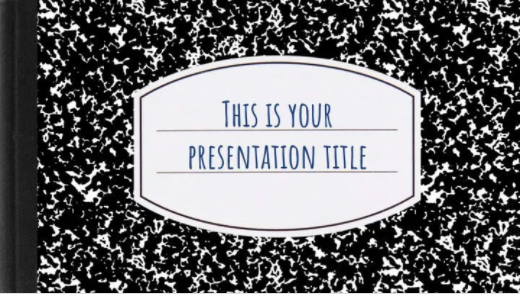

# Cours 8
## Création de palette de couleur
Joindre la palette de couleur que vous avez sélectionnée pour la présentation 2 dans votre journal de bord.   

Suggestions de sites où trouver des palettes de couleur: 
* [Coolors](https://coolors.co/)
* [Adobe coulor](https://color.adobe.com/fr/create/color-wheel)

## Choix d'un thème 
Explorer les thèmes dans l'outil de présentation numérique de votre choix. Choississez 3 thèmes que vous aimez bien et notez les dans votre journal. Vous pouvez aussi insérer des images de ces thèmes. 

#### Outil de présentation:    
Thème 1 | Thème 2 | Thème 3
--| -- | --
Nom du thème  | Nom du thème | Nom du thème 

